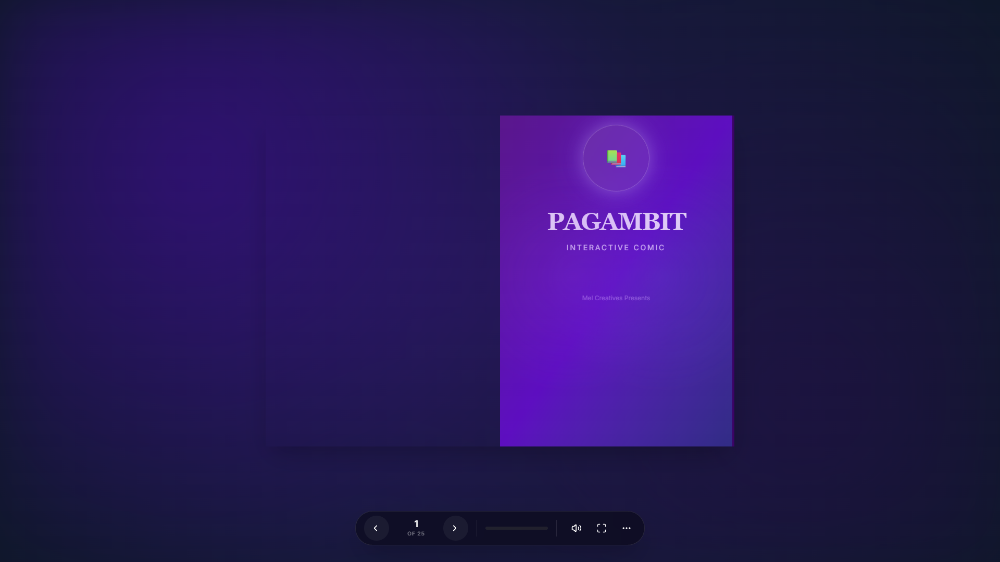
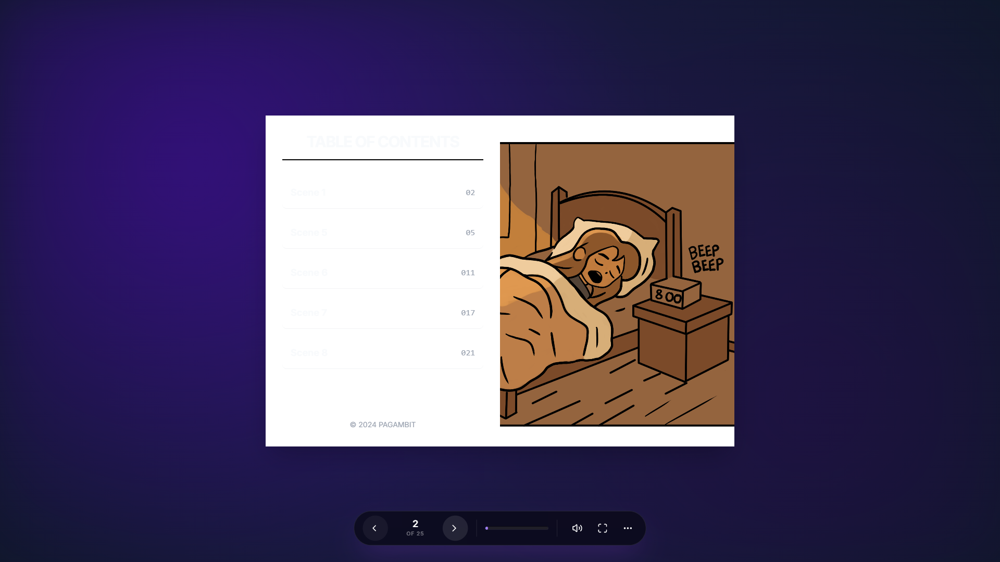
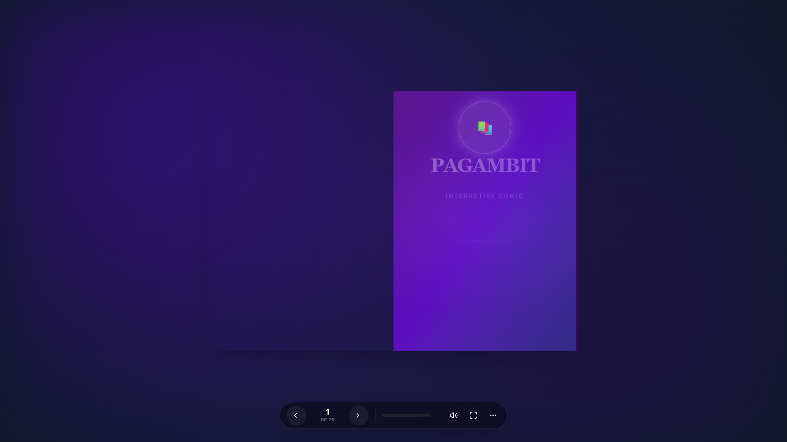

# Thesis Software User Guide/Manual

## Guide for deploying and using the system's main functions

### Getting Started

#### Introduction
**Pag-Ambit** is an immersive digital comic book experience that brings stories to life with realistic page-turning effects, interactive multimedia, and a responsive design. It bridges the gap between physical reading and digital interactivity.



#### System Requirements
To run **Pag-Ambit** effectively, your system should meet the following requirements:

*   **Operating System**: Windows, macOS, or Linux.
*   **Web Browser**: Modern browsers such as Google Chrome, Mozilla Firefox, Microsoft Edge, or Safari (Update to the latest version for best performance).
*   **Hardware**:
    *   **Processor**: Dual-core processor or better.
    *   **RAM**: 4GB or higher recommended.
    *   **Display**: 1280x720 resolution or higher.
*   **Software Prerequisites (For Developers/Deployment)**:
    *   **Node.js**: v16.0.0 or higher.
    *   **npm** (Node Package Manager) or **yarn**.
    *   **Git**: Version control system.

#### Installation
Follow these steps to deploy the application on a local machine:

1.  **Clone the Repository**
    Open your terminal or command prompt and run:
    ```bash
    git clone https://github.com/Babyama0901/Pag-Ambit-Interactive-Web-Comic-Book.git
    cd Pag-Ambit-Interactive-Web-Comic-Book
    ```

2.  **Install Dependencies**
    Install the required Node.js packages:
    ```bash
    npm install
    ```

3.  **Run the Application**
    Start the local development server:
    ```bash
    npm run dev
    ```
    Typically, the application will be accessible at `http://localhost:5173`.

---

### Usage (Per Main Feature)

#### 1. Navigation
The core feature of the system is the realistic book-reading experience.

*   **Turning Pages**: Click on the **right edge** of a page to flip forward, or the **left edge** to flip backward. Use the **Left/Right Arrow keys** on your keyboard for quick navigation.
*   **Control Bar**: Use the bottom control bar for additional navigation options.
    *   **`< Prev` / `Next >`**: Step forward or backward one page.
    *   **`Cover` / `End`**: Jump to the start or end of the book instantly.



#### 2. Reading Tools
Enhance readability with built-in tools.

*   **Zoom Slider**: Located in the control bar, drag the slider to zoom in/out of the entire book layout.
*   **Magnifier**: Click the **Magnifying Glass Icon** to toggle a lens that follows your mouse cursor, helpful for inspecting details.
*   **Night Mode**: Click the **Moon Icon** to switch to a dark theme for comfortable reading in low light.
*   **Fullscreen**: Click the **Expand Icon** to immersive yourself fully in the comic.



#### 3. Interactive Multimedia
Pages are not static; some contain dynamic elements.

*   **Cinemagraphs**: Certain panels are actually looped videos (MP4) that provide ambient motion (e.g., rain, flickering lights).
*   **Speech Bubbles**: Hover over characters or specific zones to reveal hidden dialogue or thoughts.
*   **Audio**: Page turns are accompanied by sound effects. Use the **Speaker Icon** to mute/unmute audio.

---

## Troubleshooting for fixing possible bugs

| Issue | Possible Cause | Solution |
| :--- | :--- | :--- |
| **Pages do not load** | Slow internet or server error. | Refresh the page. Check your internet connection. |
| **Audio not playing** | Browser auto-play policy blocking sound. | Click anywhere on the page to "activate" the document. Ensure system volume is up and the in-app Mute button is off. |
| **Layout looks broken** | Window size is too small or zoomed in. | Try resizing the browser window or resetting the browser zoom (Ctrl + 0). |
| **"Command not found" (Dev)** | Node.js or Git not installed. | Verify installation by running `node -v` and `git --version` in your terminal. |

---

## FAQ (Frequently Asked Questions)

**Q: Can I read this on my mobile phone?**
A: **Yes!** The application is fully responsive and supports touch gestures (swiping) for turning pages on mobile devices.

**Q: How do I save a page?**
A: Use the **Save Page** option in the "More Options" menu (three dots) to download the current view as an image.

**Q: Is the content free to use?**
A: The project is licensed under **CC BY-NC-ND 4.0**, meaning you can share it for non-commercial purposes but cannot modify it without permission.

**Q: Why is the video lagging?**
A: High-quality video assets may take time to buffer on slower connections. Allow the page to load fully before interacting.
