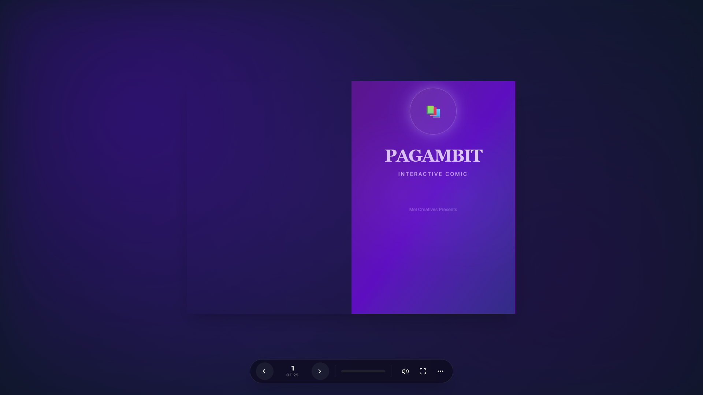
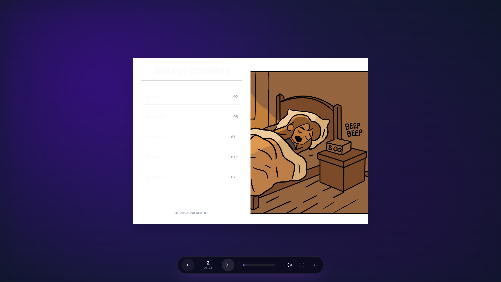
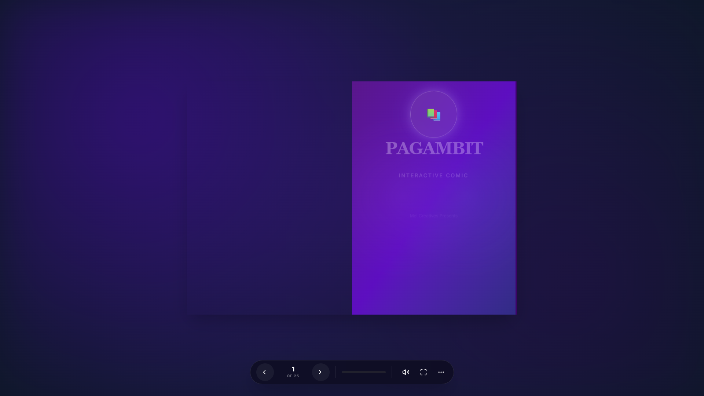

# Pag-Ambit: Interactive Web Comic Book
## Thesis Software User Guide / Manual

<br>

**Submitted to:** Research Coordinator
**By:** Babyama0901 & Team
**Date:** [Insert Year/Date]

<br>

---

# Disclaimer

This software and accompanying manual are submitted in partial fulfillment of the requirements for the thesis project. The developers and the university provide this software "as is", without warranty of any kind, express or implied, including but not limited to the warranties of merchantability, fitness for a particular purpose and non-infringement. In no event shall the authors or copyright holders be liable for any claim, damages or other liability, whether in an action of contract, tort or otherwise, arising from, out of or in connection with the software or the use or other dealings in the software.

---

# Table of Contents
1. [Guide for deploying and using the system's main functions](#1-guide-for-deploying-and-using-the-systems-main-functions)
   - [Getting Started](#getting-started)
   - [Usage (Per Main Feature)](#usage-per-main-feature)
2. [Troubleshooting for fixing possible bugs](#2-troubleshooting-for-fixing-possible-bugs)
3. [FAQ (Frequently Asked Questions)](#3-faq-frequently-asked-questions)
4. [Contact details of the development team](#4-contact-details-of-the-development-team)

---

# 1. Guide for deploying and using the system's main functions

## Getting Started

### Introduction
**Pag-Ambit** is an immersive digital comic book experience that brings stories to life with realistic page-turning effects, interactive multimedia, and a responsive design. It bridges the gap between physical reading and digital interactivity.



### System Requirements
To run **Pag-Ambit** effectively, your system should meet the following requirements:

*   **Operating System:** Windows, macOS, or Linux.
*   **Web Browser:** Modern browsers such as Google Chrome, Mozilla Firefox, Microsoft Edge, or Safari.
*   **Hardware:**
    *   **Processor:** Dual-core processor or better.
    *   **RAM:** 4GB or higher recommended.
    *   **Display:** 1280x720 resolution or higher.
*   **Software Prerequisites (For Developers/Deployment):**
    *   **Node.js:** v16.0.0 or higher.
    *   **npm** or **yarn**.
    *   **Git**: Version control system.

### Installation
Follow these steps to deploy the application on a local machine:

**1. Clone the Repository**
Open your terminal or command prompt and run:
```bash
git clone https://github.com/Babyama0901/Pag-Ambit-Interactive-Web-Comic-Book.git
cd Pag-Ambit-Interactive-Web-Comic-Book
```

**2. Install Dependencies**
Install the required Node.js packages:
```bash
npm install
```

**3. Run the Application**
Start the local development server:
```bash
npm run dev
```
Typically, the application will be accessible at `http://localhost:5173`.

---

## Usage (Per Main Feature)

### 1. Navigation
The core feature of the system is the realistic book-reading experience.

*   **Turning Pages:** Click on the **right edge** of a page to flip forward, or the **left edge** to flip backward. Use the **Left/Right Arrow keys** on your keyboard for quick navigation.
*   **Control Bar:** Use the bottom control bar for additional navigation options.
    *   **`< Prev` / `Next >`**: Step forward or backward one page.
    *   **`Cover` / `End`**: Jump to the start or end of the book instantly.



### 2. Reading Tools
Enhance readability with built-in tools.

*   **Zoom Slider:** Located in the control bar, drag the slider to zoom in/out of the entire book layout.
*   **Magnifier:** Click the **Magnifying Glass Icon** to toggle a lens that follows your mouse cursor, helpful for inspecting details.
*   **Night Mode:** Click the **Moon Icon** to switch to a dark theme for comfortable reading in low light.
*   **Fullscreen:** Click the **Expand Icon** to immersive yourself fully in the comic.



### 3. Interactive Multimedia
Pages are not static; some contain dynamic elements.

*   **Cinemagraphs:** Certain panels are actually looped videos (MP4) that provide ambient motion (e.g., rain, flickering lights).
*   **Speech Bubbles:** Hover over characters or specific zones to reveal hidden dialogue or thoughts.
*   **Audio:** Page turns are accompanied by sound effects. Use the **Speaker Icon** to mute/unmute audio.

---

# 2. Troubleshooting for fixing possible bugs

| Issue | Possible Cause | Solution |
| :--- | :--- | :--- |
| **Pages do not load** | Slow internet or server error. | Refresh the page. Check your internet connection. |
| **Audio not playing** | Browser auto-play policy blocking sound. | Click anywhere on the page to "activate" the document. Ensure system volume is up and the in-app Mute button is off. |
| **Layout looks broken** | Window size is too small or zoomed in. | Try resizing the browser window or resetting the browser zoom (Ctrl + 0). |
| **"Command not found"** | Node.js or Git not installed. | Verify installation by running `node -v` and `git --version` in your terminal. |
| **Images are blurry** | Zoomed in too much or assets not fully loaded. | Reset zoom level or wait for high-resolution assets to load. |
| **Controls not responding** | Browser may be unresponsive or script error occurred. | Try reloading the page and clearing the browser cache. |
| **Cinemagraphs not playing** | Device in battery saver mode or browser restricting background media. | Disable battery saver mode and ensure media playback limits are off. |

---

# 3. FAQ (Frequently Asked Questions)

**Q: Can I read this on my mobile phone?**
**A:** Yes! The application is fully responsive and supports touch gestures (swiping) for turning pages on mobile devices.

**Q: How do I save a page?**
**A:** Use the **Save Page** option in the "More Options" menu (three dots) to download the current view as an image.

**Q: Is the content free to use?**
**A:** The project is licensed under **CC BY-NC-ND 4.0**, meaning you can share it for non-commercial purposes but cannot modify it without permission.

**Q: Why is the video lagging?**
**A:** High-quality video assets may take time to buffer on slower connections. Allow the page to load fully before interacting.

**Q: What are the recommended browsers for the best reading experience?**
**A:** For optimal performance, we recommend using the latest versions of Google Chrome, Mozilla Firefox, or Microsoft Edge.

**Q: Do I need an internet connection to read the comic?**
**A:** Yes, an active internet connection is required to load pages, assets, and multimedia elements unless the content has been fully cached on your device.

**Q: Is there an app available for download?**
**A:** Currently, Pag-Ambit is a web-based interactive comic book and can be accessed directly via a web browser without the need to install a dedicated application.

---

# 4. Contact details of the development team

For inquiries, support, or feedback, please contact the thesis group members:

*   **[Developer Name]**, Lead Developer - [Email Address]
*   **[Designer Name]**, UI/UX Designer - [Email Address]
*   **[Author Name]**, Content Author - [Email Address]
*   **[Manager Name]**, Project Manager - [Email Address]

*(Note: Replace placeholders with actual names and relevant email addresses.)*

---

> **Pag-Ambit Interactive Web Comic Book**
> <br> © [Insert Year] All Rights Reserved.
